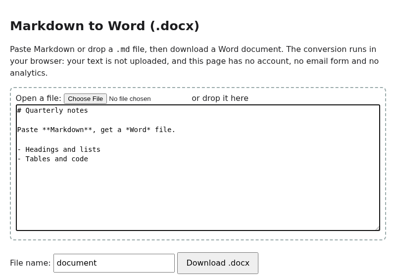

# Markdown to Word (.docx), in your browser

Paste or drop Markdown, download a Word file; it runs entirely in your browser and nothing is uploaded.

**Live:** https://megatronjeremy.github.io/markdown-to-word/

Static page (GitHub Pages serves the repo root; `docs/` holds an identical copy). Runs entirely client-side; the page CSP has `connect-src 'none'`.

AI-assisted (AI-generated code). MIT licence. The converter (`src/parser.ts`, `src/exporter.ts` and friends) is copied from the free DOCX Export Studio Obsidian plugin; it bundles the `docx` library (MIT).

Rebuild: `npm i docx esbuild && node build.mjs` writes `docs/app.js`.

There is an optional paid Pro of the plugin (not needed for this page; we may earn money if you buy it): https://xparhyx.gumroad.com/l/bpfqja?utm_source=pages
